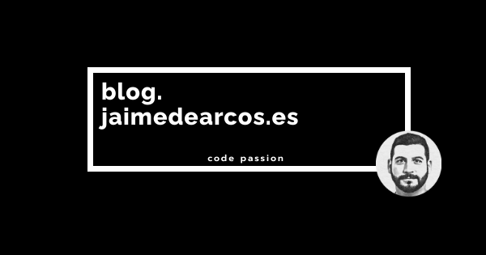

# Jaime de Arcos Recipes 

You can reach this website at [cookbook.jaimedearcos.com](blog.jaimedearcos.com)



## Template

Jekyl recipes cookbook based on [jekflix-template](https://github.com/thiagorossener/jekflix-template)
 thanks to [@thiagorossener](https://github.com/thiagorossener)

## Run locally

### Install Ruby + Jekyll

- Linux 
 
 ```bash
 sudo apt-get install ruby-full build-essential zlib1g-dev
 
 echo '# Install Ruby Gems to ~/gems' >> ~/.bashrc
 echo 'export GEM_HOME="$HOME/gems"' >> ~/.bashrc
 echo 'export PATH="$HOME/gems/bin:$PATH"' >> ~/.bashrc
 source ~/.bashrc
 
 gem install jekyll bundler
 ```

- MAC OS : https://jekyllrb.com/docs/installation/macos/


### Building site locally

```bash
bundle install --path ~/.gem
bundle exec jekyll serve
```
 